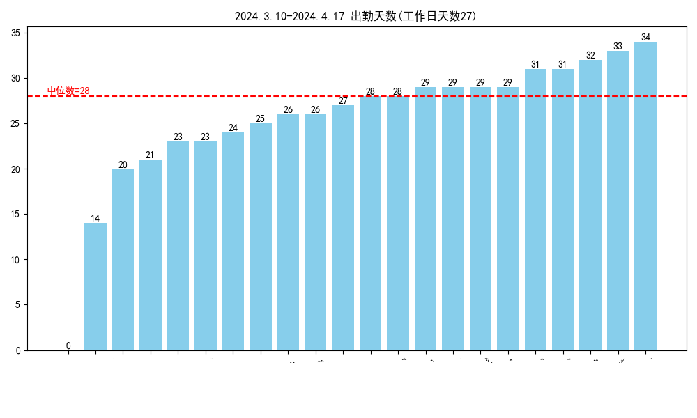
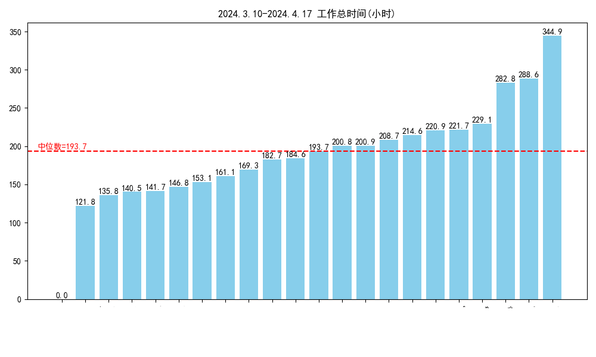
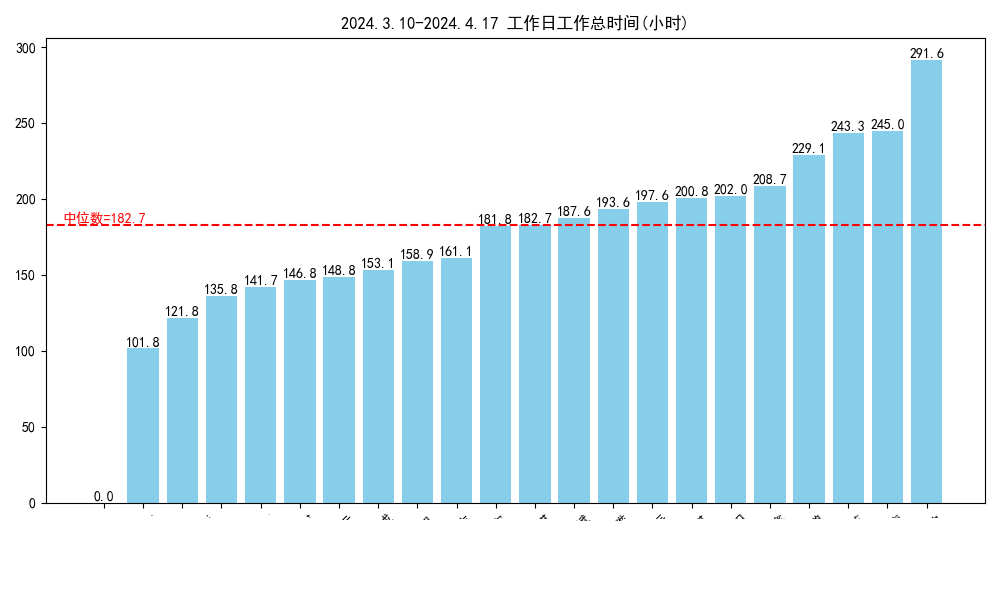
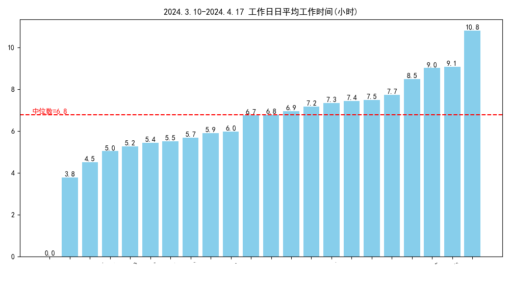
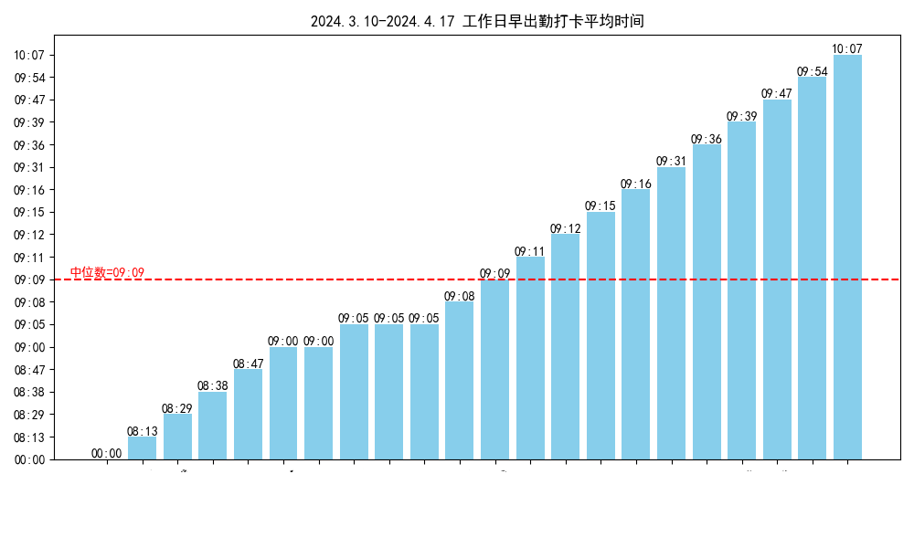
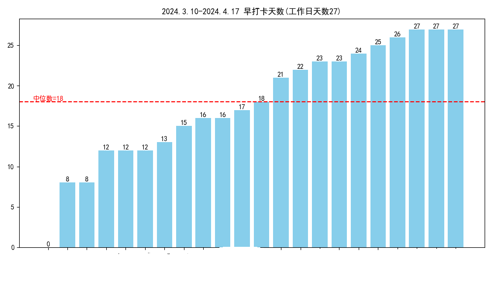
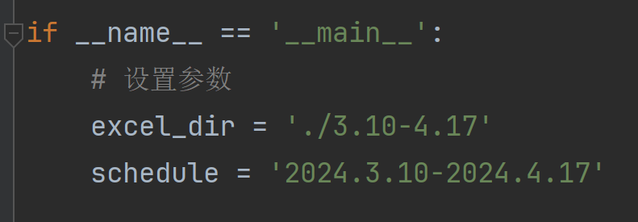

# 钉钉打卡统计及可视化

### 工具说明

依托钉钉导出考勤打卡excel表格，实现考勤统计和可视化

这个脚本统计一段时间内的打卡情况, 统计数据如下

​	统计总的工作时长，分两个类别：a.不包括休息日 和 b.包括休息日

​	统计 c.工作日平均工作时长

​	d.统计工作日出勤天数 和 e.应出勤天数

​	统计工作日，每个人，f.每个打卡节点（例如上午上班，上午下班，下午上班等，一天6个打卡节点）的平均打卡时间


### 效果展示














### 使用方法

##### step1

导出excel, 钉钉一次只能导出一个月的打卡数据，跨度大于一个月需要多次导出，将导出若干个的excel文件放到同一文件夹下

##### step2 

在使用前， 请在 excel 中将以文本显示的数字 改为 数字（目前还没找到自动解决办法，待改进），使用到的文本数字， 包括 月度汇总-出勤天数 工作时长， 包括 每日统计-工作时长

##### step3

安装依赖

```
 pip install pandas
 pin install matplotlib
```

##### step4

修改 person.txt 包含excel 导出的人员名单


##### step5 

修改超参数




##### step6

```
python summarize.py
```


### 注意事项

```
# # # matplotlib 画图, 注意 linux 下可能不包含对于字体，需要手动装
# # # 字体问题在win环境下实测可行
```


### 致谢

@dingtalk

@lebinding749@gmail.com